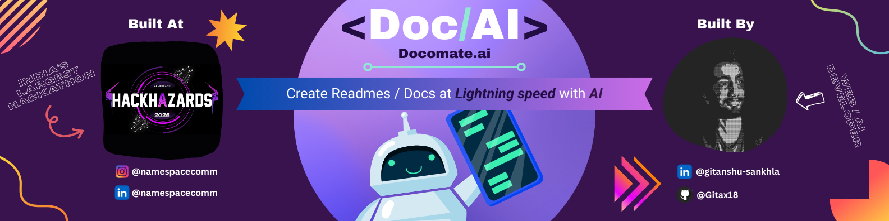

# 🚀 Docomate.AI

> Effortlessly generate GitHub READMEs or interact with your codebase using AI.

---

## 📌 Problem Statement

**Build a creative and interactive multimodal application powered by Groq, leveraging the capabilites to solve real-world problems with a focus on user experience and innovation.**

---

## 🎯 Objective

Writing code and debugging are the most exciting aspects of building any tech product. However, not every developer excels at writing documentation. Many developers struggle with writing clear and concise README files.

Docomate AI aims to solve this by allowing developers to effortlessly generate READMEs for their public GitHub repositories. There are no complex prompts or tedious forms—just paste your repo link, select the sections you want, and the README is generated in seconds.

Another major challenge, especially for beginners exploring open-source projects, is understanding the structure of an unfamiliar codebase. With Docomate AI, users can chat with the codebase, ask questions, and get contextual insights, making navigation much easier.

Currently, Docomate AI achieves around 55% - 65% accuracy for small to mid-scale projects and approximately 80% - 85% accuracy for micro-scale projects (repos with 4–7 files).

## 🧠 Team & Approach

### Team Name:

Gitanshu Sankhla (Solo Hacker so No Team)

### Team Members:

- **Gitanshu Sankhla -** Responsible for Frontend, Backend, Database, and Generative AI aspects of the project.

  [](https://github.com/Gitax18) [](https://linkedin.com/in/gitanshu-sankhla)

### Your Approach:

#### Why you chose this problem

- As a regular GitHub user, I often push even my smallest toy projects to the platform. However, I can’t always deploy them, so when I share these repositories, people have no clue how to set them up, what the project does, or what its features are. Every project deserves a good README, but writing one can take an entire weekend.

- That’s when I thought—what if we could generate READMEs in just one click and under 8 seconds?

#### Key challenges you addressed

- I had no prior experience building a Retrieval-Augmented Generation (RAG) pipeline. While I was familiar with using AI APIs, ingesting an entire repo posed a serious challenge. Pasting the entire codebase into a prompt works only for very small projects.

  To address this, I built a scraper that clones the repo and compiles all its content—along with file metadata—into a single text file. I then used Langchain to chunk this file and stored the chunks and their vector embeddings in a MongoDB database.

- The next major challenge involved MongoDB’s vector search capabilities. It turned out that MongoDB’s native vector search wasn’t compatible with the data model I used. So, I implemented a custom cosine similarity algorithm, tweaked it to return previous and next chunks for better context, and integrated it into the system. This was one of the most complex features I developed.

#### Any pivots, brainstorms, or breakthroughs during hacking

- Initially, I wanted to only focus on generating README files from a GitHub repo link. However, during the hackathon, I realized that understanding someone else’s codebase is a much bigger problem for beginners. This led to a major pivot—I decided to implement a chat interface where users could talk with the codebase to understand it better.

- While experimenting with MongoDB’s vector search capabilities, I discovered that it didn’t suit my specific data structure. This unexpected limitation forced me to brainstorm an alternative. After extensive research and testing, I ended up building a custom cosine similarity search algorithm, which actually performed better in my use case.

- I also faced a breakthrough moment while designing the scraping logic. Initially, I tried directly feeding code into the LLM, but it wasn’t scalable. The idea to build a custom repo scraper that parses file structure and contents with metadata into a vectorized knowledge base allowed me to scale the application to larger projects.

- Another breakthrough came when I decided to use BackBlaze B2 for storing generated READMEs instead of a traditional database or S3 bucket. This provided an efficient, cost-effective, and scalable way to store and serve large markdown files.

---

## 🛠️ Tech Stack

### Core Technologies Used:

| **Techonology** |                                Tools                                |
| :-------------: | :-----------------------------------------------------------------: |
|    Frontend     | React, React Query, TailwindCss, Typescript, ShadCN, React Markdown |
|     Backend     |         NestJs, Typescript, TypeOrm, Langchain, Simple-Git          |
|    Database     |                               MongoDb                               |
|       API       |               Groq-Sdk, Jina Embeddings, HuggingFace                |
|     Hosting     |                           Heroku, Vercel                            |

### Sponsor Technologies Used (if any):

- [x] **Groq:** _I utilized chat completion endpoint for generating readmes, and text-to-speech and speech-to-text along with chat completion to talk with codebase._
- [ ] **Stellar:** _Payments, identity, or token usage_

---

## ✨ Key Features

Most important features of **_Docomate AI_** is:

- ✅ Authentication and authorization for secure access to user resources.
- ✅ Users can create projects, with each project supporting multiple READMEs, documentation files, and chats.
- ✅ READMEs can be generated and stored securely on Docomate AI using BackBlaze B2 cloud storage
- ✅ Built-in Markdown editor to edit and download READMEs at any time.

---

## 📽️ Demo & Deliverables

- **Demo Video Link:** [Paste YouTube or Loom link here]
- **Pitch Deck / PPT Link:** [Paste Google Slides / PDF link here]

---

## ✅ Tasks & Bonus Checklist

- [x] **All members of the team completed the mandatory task - Followed at least 2 of our social channels and filled the form** (Details in Participant Manual)
- [x] **All members of the team completed Bonus Task 1 - Sharing of Badges and filled the form (2 points)** (Details in Participant Manual)
- [x] **All members of the team completed Bonus Task 2 - Signing up for Sprint.dev and filled the form (3 points)** (Details in Participant Manual)

---

## 🧪 How to Run the Project

### Requirements:

- Node JS, Nest JS and Typescript.
- API KEYS

  |  **API Credentials**  |                              **Website**                              |
  | :-------------------: | :-------------------------------------------------------------------: |
  |  MongoDb Credentials  |         [MongoDb Atlas](https://www.mongodb.com/cloud/atlas/)         |
  | SendGrid Credentials  |          [Sendgrid Mail Service](https://sendgrid.com/en-us)          |
  | BackBlaze Credentials | [BackBlaze B2 Cloud Storage](https://www.backblaze.com/cloud-storage) |
  |   HuggingFace Token   | [HuggingFace settings tokens](https://huggingface.co/settings/tokens) |
  |  Jina Embeddingd API  |        [Jina v2 Embedding Modal](https://jina.ai/embeddings/)         |
  |       Groq API        |             [Groq Console](https://console.groq.com/keys)             |

- To configure environment variables, navigate to the backend directory and copy .env.development.sample to .env.development. Then, paste your API keys from the above links.

### Local Setup:

#### Backend Installation

```bash
# Clone the backend repository
git clone https://github.com/Docomate-ai/docomate-ai-backend

# Install the necessary dependencies
cd docomate-ai-backend
npm install

# Copy the .env file and put the credentials
cp .env.development.sample .env.development

# Start the development server
npm run start:dev
```

#### Frontend Installation

```bash
# Clone the frontend repository
git clone https://github.com/Docomate-ai/docomate-ai-frontend

# Install the necessary dependencies
cd docomate-ai-frontend
npm install

# Start the development server
npm run dev
```

---

## 🧬 Future Scope

Docomate AI v1.0.0 successfully addresses two major developer pain points: generating GitHub documentation (README) and understanding complex codebases. In future iterations, I plan to introduce the following features:

- Auto-generating API documentation following the OpenAPI standard.
- A service similar to Docsify for creating client and developer documentation.
- Multilingual support for codebase interactions.
- Subscription-based access to premium AI models and features.

---

## 🏁 Final Words

Participating in **[Hackhazards'25](https://hackhazards.namespacecomm.in/)** has been an incredible journey. I truly stepped out of my comfort zone to create this powerful ~~project~~ product. I believe it has the potential to positively impact many developers.

Huge thanks to the **[Namespacecomm community](https://github.com/namespacecomm)** and **[@pradeepto sarkar](https://github.com/pradeeptosarkar)** for organizing this amazing event. This was my first application integrating Generative AI models, a full RAG pipeline, and cloud storage.

Thank you!
